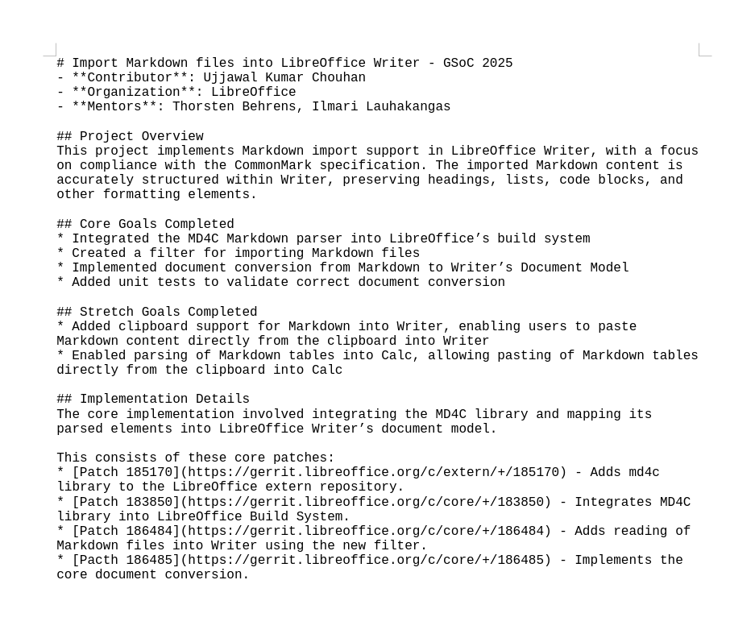
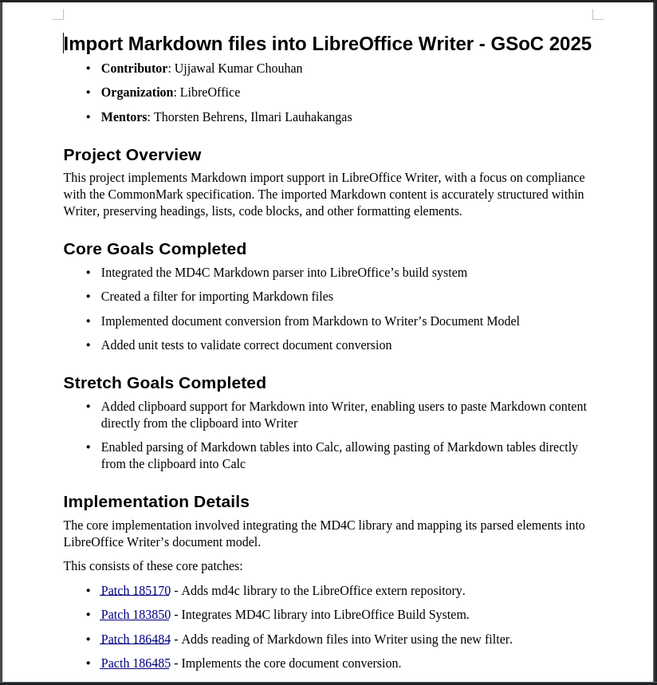

# Import Markdown files into LibreOffice Writer - GSoC 2025
- **Contributor**: Ujjawal Kumar Chouhan
- **Organization**: LibreOffice
- **Mentors**: Thorsten Behrens, Ilmari Lauhakangas

## Project Overview
This project implements Markdown import support in LibreOffice Writer, with a focus on compliance with the CommonMark specification. The imported Markdown content is accurately structured within Writer, preserving headings, lists, code blocks, and other formatting elements.

## Core Goals Completed
* Integrated the MD4C Markdown parser into LibreOffice’s build system.
* Created a filter for importing Markdown files.
* Implemented document conversion from Markdown to Writer’s Document Model.
* Added unit tests to validate correct document conversion.

## Stretch Goals Completed
* Added clipboard support for Markdown into Writer, allowing pasting of Markdown content directly from the clipboard into Writer.
* Enabled parsing of Markdown tables into Calc, allowing pasting of Markdown tables directly from the clipboard into Calc.

## Implementation Details
The core implementation involved integrating the MD4C library and mapping its parsed elements into LibreOffice Writer’s document model.

This consists of these core patches:
* [Patch 185170](https://gerrit.libreoffice.org/c/extern/+/185170) - Adds md4c library to the LibreOffice extern repository.
* [Patch 183850](https://gerrit.libreoffice.org/c/core/+/183850) - Integrates MD4C library into LibreOffice build system.
* [Patch 186484](https://gerrit.libreoffice.org/c/core/+/186484) - Adds reading of Markdown files into Writer using the new filter.
* [Patch 186485](https://gerrit.libreoffice.org/c/core/+/186485) - Implements the core document conversion.

## Demonstration
| Before                                            | After                                         |
| -------------                                         | -------------                                     |
|                                      |                                   |
| No Formatting Present in the document.                    | Document is correctly formatted.                  |
| Plain text without structure.                          | Well-structured document with proper formatting applied.      |
| Limited usability of Markdown content in LibreOffice.  | Seamless integration of Markdown into LibreOffice workflow. |

## Contributions Overview
### Core Patches
* [Patch 185170](https://gerrit.libreoffice.org/c/extern/+/185170)
* [Patch 183850](https://gerrit.libreoffice.org/c/core/+/183850)
* [Patch 186484](https://gerrit.libreoffice.org/c/core/+/186484)
* [Patch 186485](https://gerrit.libreoffice.org/c/core/+/186485)

### Unit tests
* [Patch 187449](https://gerrit.libreoffice.org/c/core/+/187449)
* [Patch 188082](https://gerrit.libreoffice.org/c/core/+/188082)

### Bug fixes and Others
* [Patch 187622](https://gerrit.libreoffice.org/c/core/+/187622)
* [Patch 187659](https://gerrit.libreoffice.org/c/core/+/187659)
* [Patch 187658](https://gerrit.libreoffice.org/c/core/+/187658)
* [Patch 187792](https://gerrit.libreoffice.org/c/core/+/187792)
* [patch 188067](https://gerrit.libreoffice.org/c/core/+/188067)
* [Patch 188528](https://gerrit.libreoffice.org/c/core/+/188528)
* [Patch 190084](https://gerrit.libreoffice.org/c/core/+/190084)
* [Patch 190286](https://gerrit.libreoffice.org/c/core/+/190286)

## Future Work
* **Optimize Performance**: Enhance the importer to improve efficiency and reduce loading times for large Markdown files.
* **Robust Error Handling**: Strengthen the importer’s error handling to gracefully handle errors encountered during conversion
* **Error Reduction & Completeness**: Resolve any remaining conversion errors, while ensuring that all Markdown elements are fully and accurately mapped into Writer.
* **Extend Support to Impress**: Continue work on importing Markdown files into LibreOffice Impress ([currently under development](https://gerrit.libreoffice.org/c/core/+/189448)).
